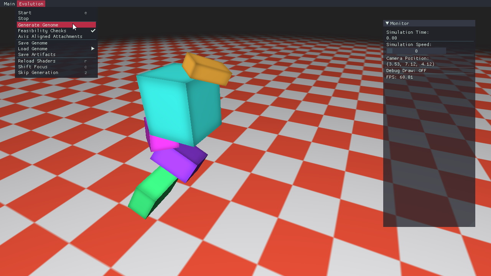
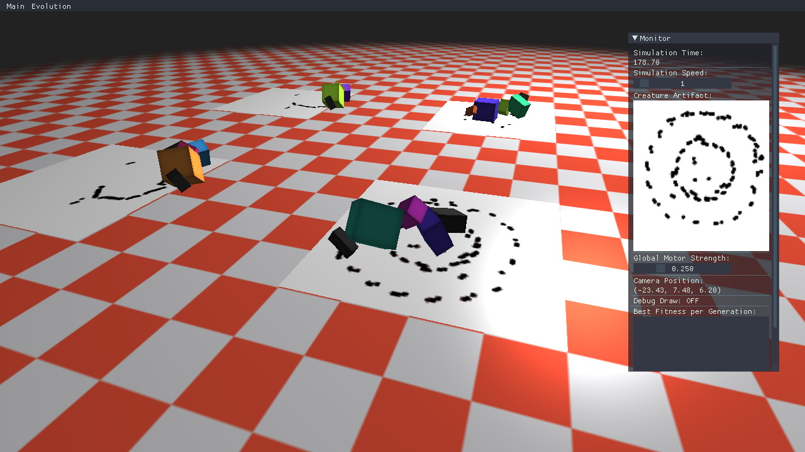

# neatures
## Evolving virtual embodied agents by evaluating their creative output

Master's thesis project (WORK IN PROGRESS)

Lesley van Hoek / Leiden University / Media Technology MSc

tools/libraries:
- openFrameworks 0.11
- Bullet Physics 2.89-1 (w/ multithreading)
- Boost 1.72*
- MultiNEAT (https://github.com/lshoek/MultiNEAT)

* Uses a modified version of openFrameworks 0.11 using boost 1.72 (instead of 1.65). Copy the libs to the appropriate OF locations to compile successfully.

ofx dependencies:
- ofxOpenCv
- ofxImGui (https://github.com/jvcleave/ofxImGui)
- ofxGrabCam (https://github.com/elliotwoods/ofxGrabCam)
- ofxIniSettings (https://github.com/companje/ofxIniSettings)
- ofxShadowMap (https://github.com/lshoek/ofxShadowMap)

