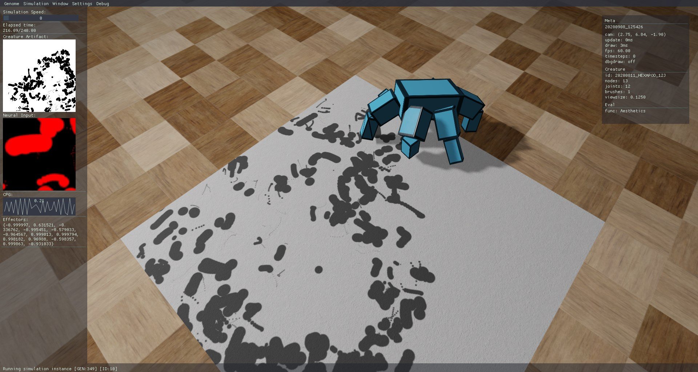

# Neatures: Evolving arbitrary virtual embodied agents using external artifact evaluations

Master's thesis project

Lesley van Hoek / Leiden University / Media Technology MSc

This project is a simulator application for https://github.com/lshoek/creative-evo-controller

tools/libraries:
- openFrameworks 0.11
- Bullet Physics 2.89-1 (w/ multithreading)

ofx dependencies:
- ofxOpenCv
- ofxImGui (https://github.com/jvcleave/ofxImGui)
- ofxIniSettings (https://github.com/companje/ofxIniSettings)
- ofxShadowMap (https://github.com/lshoek/ofxShadowMap)

# Preview

# License
This work is licensed under a MIT License.
Copyright (c) 2020 Lesley van Hoek
